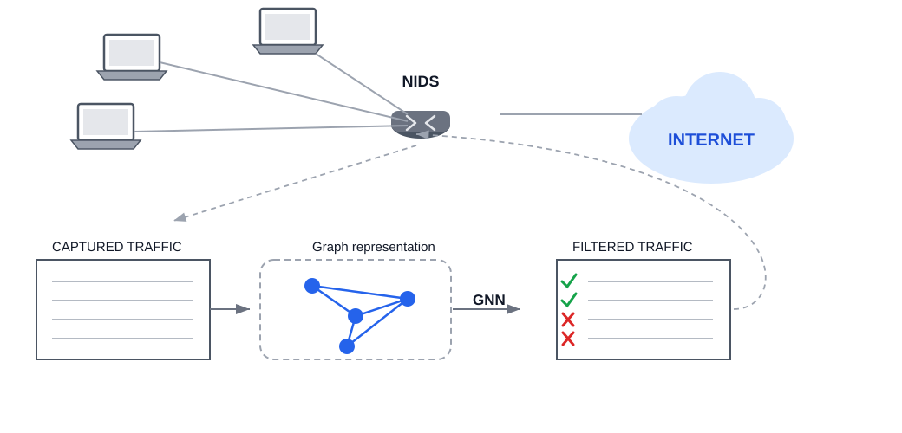
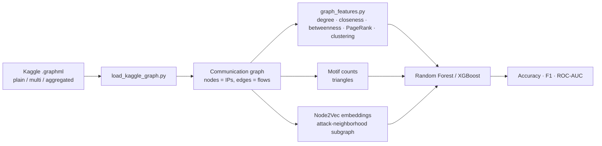

# Network Intrusion Detection Through Graph Structure

[](https://github.com/Mangesh-Bhattacharya/graph-based-network-intrusion-detection/blob/main/LICENSE) [](https://github.com/Mangesh-Bhattacharya/graph-based-network-intrusion-detection/blob/main/requirements.txt) [](https://networkx.org/) [](https://github.com/Mangesh-Bhattacharya/graph-based-network-intrusion-detection/blob/main)

> Final project for our Complex Networks course. Four of us spent the semester asking
> a simple question: if you stop looking at network traffic as a spreadsheet of
> isolated flows and start looking at it as a graph, does an attacker's shape in
> that graph give them away?

Short answer: yes, for a meaningful chunk of them - and the "why" turned out to be
more interesting than the accuracy number.

---

## Why we built this

Most intrusion detection tutorials treat each network flow as a row in a table and
train a classifier on packet counts, byte counts, duration, that sort of thing. That
throws away something free: *who talked to whom*. An IP address that suddenly starts
fanning out connections to hundreds of other machines is doing something structurally
different from one having a normal conversation with a mail server, even before you
look at a single packet's contents.

So we rebuilt the same intrusion-detection problem as a graph problem:

- **Nodes** = IP addresses
- **Edges** = the fact that two IPs exchanged at least one flow
- **Edge attributes** = packet/byte counts, duration, protocol, flow count
- **Node label** = did this IP ever touch a flow labeled as an attack?

Then we asked what centrality, motif, and embedding features can tell us about
attacker behavior that raw flow statistics can't - and whether that signal is
strong enough to actually help a classifier.

### The concept, visually



This diagram is the textbook version of the idea above: a NIDS sits inline between
the LAN and the internet, captures traffic, represents it as a graph, and uses a
graph neural network (GNN) to decide what to let through. It's the concept that
motivated the whole project - traffic-as-a-graph instead of traffic-as-a-spreadsheet
- and it's worth including because it explains *why* graphs are the right lens here:
structural position in a communication graph (who a node talks to, how central it is,
whether it clusters with other suspicious nodes) carries information that
per-flow statistics alone don't.

It is **not** a picture of what we actually built, and we want to be upfront about
that rather than let the diagram overstate our scope:

- It shows **live, inline filtering** at the router. Our pipeline is **offline**:
  we build a graph from a flow-log snapshot (or a pre-built Kaggle graph), extract
  features, and classify after the fact - see [How the graph gets built](#how-the-graph-gets-built).
- It shows a **GNN** doing the classification. We used **Node2Vec embeddings feeding
  Random Forest / XGBoost** instead; GCN/GraphSAGE/GAT were part of the original plan
  but cut for practical reasons - see [What we deliberately left out](#what-we-deliberately-left-out).

Think of this image as the "north star" architecture and the flowchart later in this
README as the "what we actually shipped" version.

---

## What we found (the short version)

| Question                                         | Answer                                                                                                           |
| ------------------------------------------------- | ------------------------------------------------------------------------------------------------------------------ |
| Is the network graph hub-dominated?              | Yes - one node touches ~30% of all edges; 95.8% of nodes have degree exactly 1                                   |
| Do attackers hide on the busiest nodes?          | No. The top 5 hubs by degree touch **zero** attack-labeled edges                                                 |
| Are triangles (3-way mutual connections) common? | Rare - only 47 in a 41,073-node graph, touching 0.13% of nodes                                                   |
| Does `nx.clustering()` run on a graph this size? | Not in any reasonable time - we derive it from triangle counts instead (verified identical)                      |
| Does Node2Vec run on the full graph?             | No - same mega-hub problem. We scope it to the 962-node neighborhood around attack activity                      |
| Do graph features actually help detection?       | Random Forest / XGBoost hit **0.92-0.96 accuracy, 0.93-0.96 ROC-AUC** vs. a 0.50 ROC-AUC majority-class baseline |
| Which features mattered most?                    | Node2Vec embedding dimensions - ahead of every hand-built centrality feature                                     |

The full reasoning, numbers, and sanity checks for each of these live in the
notebooks - see [Notebooks](#notebooks) below. We're intentionally not just
dumping a big accuracy number here; the point of this project was understanding *why*
the graph looks the way it does before trusting any model built on top of it.

---

## Datasets

| Dataset                            | What it is                                                                                                                           | Where it's used                                                                    |
| ----------------------------------- | --------------------------------------------------------------------------------------------------------------------------------------- | -------------------------------------------------------------------------------------- |
| **Kaggle "0.1M-Stratified" graph** | A pre-built graph derived from 100,000 sampled NetFlow records, shipped in three edge-handling variants (plain / aggregated / multi) | `notebooks/01_...kaggle.ipynb` - our main feature-extraction and modeling notebook |

We also looked at CIC-IoT-2023, UNSW-NB15, TON_IoT, and Bot-IoT while scoping the
project, but didn't end up using them - IoT-specific and heavier real-time
dataset choices weren't a good fit once we'd committed to the flow-log + graph
approach above.

---

## How the graph gets built



Every one of those arrows is a real, runnable step in the notebooks - nothing here
is a mockup. Where the straightforward approach didn't scale (looking at you,
`nx.clustering()` and full-graph Node2Vec), we say so in the notebook, explain why,
and show the workaround plus proof that it gives the same answer.

---

## Notebooks

| Notebook                                                                                                                                                                                                             | Covers                                                                                                                                                                                           |
| ----------------------------------------------------------------------------------------------------------------------------------------------------------------------------------------------------------------- | -------------------------------------------------------------------------------------------------------------------------------------------------------------------------------------------- |
| [`01_graph_construction_and_visualization_kaggle.ipynb`](https://github.com/Mangesh-Bhattacharya/graph-based-network-intrusion-detection/blob/main/notebooks/01_graph_construction_and_visualization_kaggle.ipynb) | Loading the Kaggle graph variants, degree/closeness/betweenness/PageRank, motif counts + derived clustering coefficient, Node2Vec embeddings, Random Forest / XGBoost models, feature importance |

## Source

| Module                      | Responsibility                                                                                                                                                  |
| ---------------------------- | ----------------------------------------------------------------------------------------------------------------------------------------------------------- |
| `src/graph_construction.py` | Flow logs → communication graph; chunked label-aware sampling so we don't accidentally build an "attack graph" out of zero attacks; time-windowed aggregation |
| `src/graph_features.py`     | Degree/closeness/betweenness centrality, PageRank, clustering coefficient, plus verification checks (`sum(degrees) == 2 * edges`, etc.)                        |
| `src/load_kaggle_graph.py`  | Loads and compares the three pre-built Kaggle `.graphml` variants                                                                                               |
| `src/visualize.py`          | Readable graph plots that auto-sample large graphs instead of rendering an unreadable hairball, plus feature-distribution histograms                          |

---

## Repository layout

```
graph-based-network-intrusion-detection/
├── topology/
│   └── nids_topology_diagram.svg   # conceptual NIDS/graph/GNN architecture (see "The concept, visually")
├── data/
│   └── kaggle/     # pre-built graphs (plain / multi / aggregated .graphml)
├── src/
│   ├── graph_construction.py
│   ├── graph_features.py
│   ├── visualize.py
│   └── load_kaggle_graph.py
├── notebooks/
│   ├── 01_graph_construction_and_visualization_kaggle.ipynb
├── requirements.txt
└── README.md
```

---

## Getting it running

```
git clone https://github.com/Mangesh-Bhattacharya/graph-based-network-intrusion-detection.git
```

```
cd graph-based-network-intrusion-detection
```

```
pip install -r requirements.txt
```

```
jupyter notebook notebooks/01_graph_construction_and_visualization_kaggle.ipynb
```

A couple of things worth knowing before you run it:

- `numpy` is pinned below 2.0 - some `node2vec`/`gensim` wheels aren't built against
  the numpy 2.x ABI yet, and this pin is the known-good combination across Windows,
  macOS, and Linux.
- `torch` / `torch-geometric` are CPU-only requirements here; nothing in this repo
  needs a GPU. If the default `torch` wheel is a large download on your connection,
  install the CPU-only build directly: `pip install torch --index-url https://download.pytorch.org/whl/cpu`.
- The GNN models mentioned in the Methods section below (GCN, GraphSAGE, GAT) are
  listed as part of the original project scope, but we ended up not implementing them.

---

## Methods

**Graph construction**

- Build an undirected communication graph from flow logs or from the pre-built
  Kaggle graphs
- Aggregate repeated flows between the same pair of IPs into weighted edges
  (flow count, total packets, total bytes, attack-flow count)
- Optional time-windowing for temporal analysis

**Feature extraction**

- Degree, closeness, and betweenness centrality
- PageRank
- Clustering coefficient (derived from triangle counts when the direct
  computation doesn't scale - see the notebook for why and the check that
  proves it's the same number)
- Triangle / motif counts
- Node2Vec structural embeddings

**Modeling**

- Random Forest and XGBoost, evaluated with accuracy, F1, and ROC-AUC against
  a majority-class baseline

## What we deliberately left out

GCN, GraphSAGE, and GAT were part of our original plan and are still listed under
Methods above because they shaped how we thought about the feature set (Node2Vec
in particular exists as a stand-in for a learned GNN embedding). We cut them from
the final implementation for a practical reason: `torch-geometric` is a genuinely
fragile install on Windows, and between debugging that and training three separate
GNN architectures, the time cost wasn't worth it this close to the presentation
deadline. Everything else in this repo runs and is verified independently of that
decision - we'd rather say plainly what didn't make it in than quietly pretend the
scope was smaller than it was.

---

## Team

Built by a team of four for our Complex Networks course:

- Jothi Jayaraman
- Mangesh Bhattacharya
- Salmaan Kuthpudeen
- Vishnuprasath Sathyanarayanan

## Project timeline

| Weeks | Focus                                     |
| ------ | ------------------------------------------ |
| 1-2   | Dataset selection and preprocessing       |
| 3-4   | Graph construction and feature extraction |
| 5-6   | ML/GNN model training                     |
| 7     | Visualization and analysis                |
| 8     | Final report and presentation             |

---

## License

[MIT](https://github.com/Mangesh-Bhattacharya/graph-based-network-intrusion-detection/blob/main/LICENSE)
